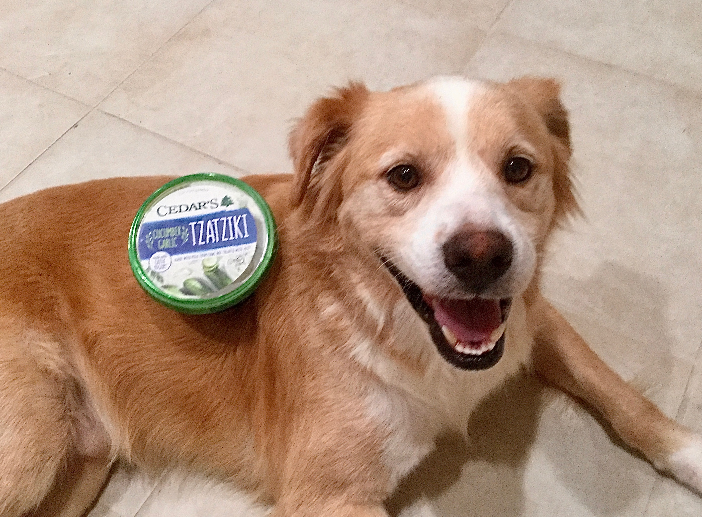

```{r setup, include=FALSE}
options(htmltools.dir.version = FALSE)
```

```{r xaringan-themer, include=FALSE, warning=FALSE}
library(xaringanthemer)
style_mono_accent(
  base_color = "#09274B",
  base_font_size = "32px", 
  header_h1_font_size = "2.0rem",
  header_h2_font_size = "1.5rem",
  header_h3_font_size = "1.25rem", 
  header_background_content_padding_top = "2rem", 
  header_font_google = google_font("Lato"),
  text_font_google   = google_font("Montserrat", "300", "300i", "500"),
  code_font_google   = google_font("Source Code Pro", "300", "500"), 
  extra_css = list("p" = list("margin-block-start" = "0.5em", 
                              "margin-block-end" = "0.5em"), 
                   "ul" = list("margin-block-start" = "0.5em", 
                              "margin-block-end" = "0.5em"), 
                   "li" = list("margin-block-start" = "0.5em", 
                              "margin-block-end" = "0.5em"), 
                   "pre" = list("margin-top" = "0.5em", 
                              "margin-bottom" = "0.5em"), 
                   ".small" = list("font-size" = "80%"), 
                   ".tiny" = list("font-size" = "50%")), 
  link_color = "#339944"
)
```
class: inverse, center, middle

# `r desc::desc_get('Title', '..')`
### `r rmarkdown::metadata$author`
### `r rmarkdown::metadata$institute`
### (updated: `r Sys.Date()`)

---
# Motivations

* because

---
# Prerequisites

This lesson assumes you:
`r gsub("\n ", "\n", desc::desc_get("prerequisites"))`

Such as via `r desc::desc_get("priorCourse")`

---
# Learning Outcomes

By the end of the workshop, participants will be able to:

`r gsub("\n ", "\n", desc::desc_get("learningOutcomes"))`

---
class: inverse, center, middle

# Subheading

---
# Topic

Description

--
## So what?

* reason!
* another reason!

---

```{r, echo = FALSE, out.width = "70%", fig.cap = "Falafel!", fig.alt = "Alt Text: A tan and white dog (retriever mix) is lying on a tile floor and looking up at the camera with his mouse open, seemingly happy. There is a food container on his body with the label 'Tzatziki' visible. (This is a visual pun on the dog's name, Falafel)"}

```

---
# Thanks

* Let me know what content you'd like to see
* Contact me for additional questions or consultation requests!
* Check back in on the libguide for more modules and contact info:
  - https://guides.uflib.ufl.edu/reproducibility
